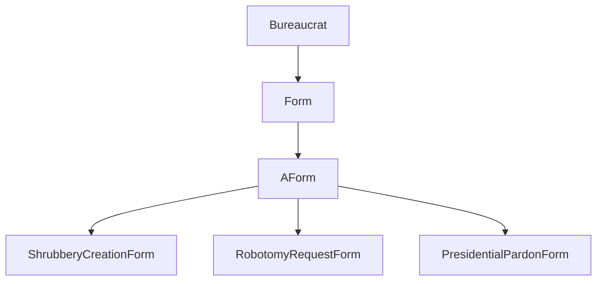

# ⚠️ CPP05 – Excepciones y control de flujo

### 🎯 Objetivo del módulo
Aprender el uso de **excepciones en C++** como mecanismo de control de errores seguro y estructurado.  
El módulo entrena al estudiante para reemplazar el manejo de errores tradicional basado en *return codes* por un enfoque **orientado a objetos** mediante `try`, `throw` y `catch`.

Además, se profundiza en el concepto de **jerarquías de clases de excepción**, el **control del flujo de ejecución**, y la importancia de **mantener la coherencia del estado del programa** tras un error.

---

### 🧠 Conceptos teóricos clave

| Concepto | Descripción |
|-----------|-------------|
| **Excepciones (`try / throw / catch`)** | Mecanismo para manejar errores en tiempo de ejecución sin romper la lógica del programa. |
| **Jerarquías de excepciones** | Las clases de error heredan de `std::exception`, lo que permite capturarlas de forma genérica. |
| **Control de flujo** | Permite definir cómo se recupera el programa después de un error. |
| **Const-correctness en excepciones** | Las funciones `what()` deben ser constantes (`const noexcept`). |
| **Buenas prácticas** | Solo lanzar excepciones en situaciones excepcionales; evitar usarlas como lógica normal del programa. |

---

### 🧩 Ejercicio ex00 – *Bureaucrat*

#### 🎯 Objetivo
Implementar una clase que controle los **límites de valores** mediante excepciones personalizadas.

#### 💡 Descripción
`Bureaucrat` tiene un atributo `grade` que representa su rango.  
Los valores válidos están entre **1 (más alto)** y **150 (más bajo)**.  
Si un valor excede esos límites, se lanza una excepción.

```cpp
class Bureaucrat {
private:
    const std::string _name;
    int _grade;
public:
    Bureaucrat(std::string name, int grade);
    ~Bureaucrat();

    const std::string& getName() const;
    int getGrade() const;

    void incrementGrade();
    void decrementGrade();

    class GradeTooHighException : public std::exception {
        const char* what() const noexcept override;
    };
    class GradeTooLowException : public std::exception {
        const char* what() const noexcept override;
    };
};
```

#### 🧠 Conceptos aprendidos
- **Lanzamiento de excepciones personalizadas (`throw`)**
- **Captura con `try / catch`**
- **Diseño de clases robustas con validación interna**
- **Sobrecarga del operador `<<` para salida formateada**

---

### 🧩 Ejercicio ex01 – *Forms and Bureaucrats*

#### 🎯 Objetivo
Introducir relaciones entre clases y manejo de errores cruzados.

#### 💡 Descripción
Se añade la clase `Form`, que puede ser firmada por un `Bureaucrat` si su `grade` es lo suficientemente alto.  
Las reglas se verifican mediante excepciones.

```cpp
class Form {
private:
    const std::string _name;
    bool _isSigned;
    const int _gradeToSign;
    const int _gradeToExecute;
public:
    Form(std::string name, int gradeSign, int gradeExec);
    void beSigned(const Bureaucrat& b);

    class GradeTooHighException : public std::exception {
        const char* what() const noexcept override;
    };
    class GradeTooLowException : public std::exception {
        const char* what() const noexcept override;
    };
};
```

#### 🧠 Conceptos aprendidos
- **Comunicación entre clases mediante excepciones**
- **Control de flujo seguro en relaciones jerárquicas**
- **Uso del principio de *encapsulación con validación***

---

### 🧩 Ejercicio ex02 – *AForm, Shrubbery, Robotomy, Presidential***

#### 🎯 Objetivo
Aplicar el **polimorfismo** al sistema de formularios con **ejecuciones específicas** según el tipo de formulario.

#### 💡 Descripción
Se crean tres clases derivadas de una clase base `AForm`, cada una con su propio comportamiento de ejecución y validación.

```cpp
class AForm {
protected:
    std::string _target;
public:
    virtual void execute(const Bureaucrat& executor) const = 0;
};
```

Ejemplos de formularios:
- `ShrubberyCreationForm` — genera un archivo ASCII con árboles 🌲  
- `RobotomyRequestForm` — realiza una “robotomía” con 50% de éxito 🤖  
- `PresidentialPardonForm` — emite un perdón presidencial 🏛️  

#### 🧠 Conceptos aprendidos
- **Polimorfismo aplicado a excepciones**
- **Control de flujo jerárquico**
- **Uso de `virtual` y `override` con validación**
- **Manejo de errores específicos y generales**

---

### 📊 Diagrama CPP05



---

### 🧾 Resumen CPP05

| Concepto | Descripción |
|-----------|-------------|
| Excepciones | Control estructurado de errores en C++ |
| `try` / `throw` / `catch` | Flujo de manejo de errores |
| Clases personalizadas de excepción | Derivadas de `std::exception` |
| Polimorfismo en excepciones | Sobrescritura de `what()` |
| Robustez | Código seguro ante errores y validaciones |

💡 **CPP05** marca la transición hacia el **C++ robusto y orientado a errores**, donde cada clase gestiona su coherencia interna y se comunica mediante excepciones seguras.
