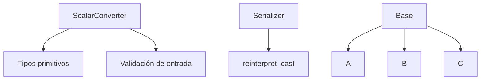

# 🔄 CPP06 – Conversión de tipos y castings

### 🎯 Objetivo del módulo
Aprender a manipular y convertir **tipos de datos en C++**, tanto de forma **implícita** como **explícita**, utilizando los operadores de *casting* modernos del lenguaje (`static_cast`, `dynamic_cast`, `const_cast`, `reinterpret_cast`).  
Este módulo busca que el estudiante comprenda cómo C++ maneja la **conversión entre tipos primitivos, objetos y punteros**, y cuándo cada conversión es segura o peligrosa.

---

### 🧠 Conceptos teóricos clave

| Concepto | Descripción |
|-----------|-------------|
| **Conversión implícita** | El compilador transforma un tipo en otro automáticamente cuando es posible sin pérdida de información. |
| **Conversión explícita** | Se realiza mediante *casts* para indicar intencionalmente el cambio de tipo. |
| **`static_cast`** | Conversión segura y en tiempo de compilación entre tipos compatibles. |
| **`dynamic_cast`** | Conversión segura entre punteros o referencias dentro de una jerarquía de clases con funciones virtuales. |
| **`const_cast`** | Permite agregar o eliminar la cualificación `const` de una variable. |
| **`reinterpret_cast`** | Conversión de bajo nivel (peligrosa) que trata bits de memoria como otro tipo. |
| **Conversión de cadenas y números** | Uso de `std::stoi`, `std::stof`, `std::to_string`, etc. |

---

### 🧩 Ejercicio ex00 – *Scalar Converter*

#### 🎯 Objetivo
Implementar una clase que convierta una **cadena de texto** a los tipos primitivos `char`, `int`, `float` y `double`.

#### 💡 Descripción
El programa recibe un único argumento (una cadena) y determina su tipo antes de imprimir las conversiones posibles.

```cpp
int main(int argc, char **argv) {
    if (argc != 2) {
        std::cerr << "Usage: ./convert <literal>" << std::endl;
        return 1;
    }
    ScalarConverter::convert(argv[1]);
    return 0;
}
```

```cpp
class ScalarConverter {
private:
    ScalarConverter();
public:
    static void convert(std::string const &literal);
};
```

Ejemplo de salida:
```
$ ./convert 42
char: '*'
int: 42
float: 42.0f
double: 42.0
```

#### 🧠 Conceptos aprendidos
- **Conversión de cadenas a tipos primitivos.**
- **Validación y detección de tipo de dato.**
- **Uso de funciones estándar: `std::stoi`, `std::stod`, `std::stof`.**
- **Formato de salida y control de precisión.**

---

### 🧩 Ejercicio ex01 – *Serialization*

#### 🎯 Objetivo
Aprender a convertir punteros a valores enteros (y viceversa) mediante **reinterpretación de memoria**.

#### 💡 Descripción
Se define una estructura `Data` y una clase que implementa funciones `serialize` y `deserialize` usando `reinterpret_cast`.

```cpp
struct Data {
    std::string name;
    int age;
};
```

```cpp
class Serializer {
public:
    static uintptr_t serialize(Data* ptr);
    static Data* deserialize(uintptr_t raw);
};
```

Ejemplo:
```cpp
Data d = {"Alice", 25};
uintptr_t raw = Serializer::serialize(&d);
Data* ptr = Serializer::deserialize(raw);
std::cout << ptr->name << " - " << ptr->age << std::endl;
```

#### 🧠 Conceptos aprendidos
- **Uso de `reinterpret_cast` para manipular direcciones.**
- **Comprensión del tipo `uintptr_t`.**
- **Conversión entre punteros y enteros de forma controlada.**
- **Representación interna de datos en memoria.**

---

### 🧩 Ejercicio ex02 – *Dynamic Casting*

#### 🎯 Objetivo
Aplicar **casting dinámico (`dynamic_cast`)** para identificar el tipo real de objetos en tiempo de ejecución.

#### 💡 Descripción
Se crea una jerarquía de clases con una base `Base` y tres derivadas (`A`, `B`, `C`).  
El programa genera una instancia aleatoria y luego la identifica mediante `dynamic_cast`.

```cpp
class Base { public: virtual ~Base() {}; };
class A : public Base {};
class B : public Base {};
class C : public Base {};

Base* generate();
void identify(Base* p);
void identify(Base& p);
```

Uso típico:
```cpp
Base* ptr = generate();
identify(ptr);   // output: "Actual type: B"
identify(*ptr);  // output: "Actual type: B"
```

#### 🧠 Conceptos aprendidos
- **Uso práctico de `dynamic_cast`.**
- **Identificación de tipos en tiempo de ejecución (RTTI).**
- **Comparación entre `dynamic_cast` y `static_cast`.**
- **Diseño de jerarquías con funciones virtuales.**

---

### 📊 Diagrama CPP06



---

### 🧾 Resumen CPP06

| Concepto | Descripción |
|-----------|-------------|
| `static_cast` | Conversión segura en tiempo de compilación |
| `dynamic_cast` | Conversión segura en tiempo de ejecución |
| `const_cast` | Añade o elimina `const` |
| `reinterpret_cast` | Reinterpreta los bits de memoria (peligroso) |
| RTTI | *Run-Time Type Information* para determinar tipos reales |
| Conversión de cadenas | De texto a numérico (`std::stoi`, `std::stof`, etc.) |

💡 **CPP06** enseña cómo C++ gestiona la **tipificación estricta** y cómo el programador puede manipular tipos con precisión, seguridad y control total sobre la memoria.
