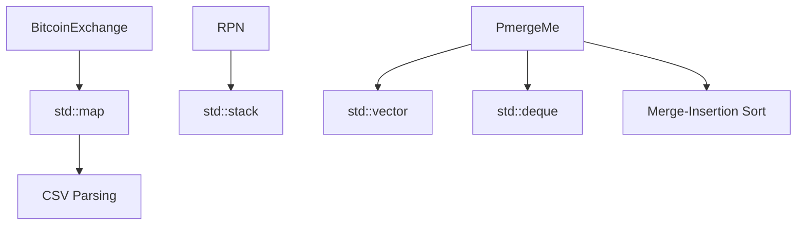

# ⚡ CPP09 – Contenedores personalizados y rendimiento

### 🎯 Objetivo del módulo
Diseñar y analizar **estructuras de datos y algoritmos personalizados**, aplicando los principios de eficiencia, modularidad y reutilización.  
El módulo CPP09 consolida todo lo aprendido en los anteriores — plantillas, STL, iteradores y algoritmos — para construir contenedores y sistemas propios que compitan en **rendimiento y complejidad algorítmica** con los del estándar.

---

### 🧠 Conceptos teóricos clave

| Concepto | Descripción |
|-----------|-------------|
| **Eficiencia algorítmica** | Evaluar el coste temporal y espacial de las operaciones. |
| **Contenedores personalizados** | Implementación de estructuras propias basadas en plantillas (`stack`, `queue`, `deque`, `map`, etc.). |
| **Algoritmos de ordenación y búsqueda** | Implementaciones prácticas de *merge sort*, *binary search*, y más. |
| **STL como referencia** | Replicar el comportamiento de contenedores estándar para entender su funcionamiento interno. |
| **Complejidad Big O** | Análisis del tiempo de ejecución de operaciones comunes. |
| **Optimización y rendimiento** | Técnicas para minimizar copias, uso de `const &`, y operaciones eficientes sobre datos. |

---

### 🧩 Ejercicio ex00 – *Bitcoin Exchange*

#### 🎯 Objetivo
Leer, almacenar y procesar datos históricos de valores de Bitcoin.  
Implementar un sistema que calcule el valor de una cantidad en función del precio histórico más cercano a una fecha dada.

#### 💡 Descripción
El programa recibe un archivo CSV con pares de valores (`date, value`) y un archivo de entrada con consultas (`date | amount`).  
Debe validar los datos, buscar la fecha más próxima y calcular el resultado.

```cpp
class BitcoinExchange {
private:
    std::map<std::string, float> _database;
public:
    BitcoinExchange();
    BitcoinExchange(const BitcoinExchange &other);
    BitcoinExchange &operator=(const BitcoinExchange &other);
    ~BitcoinExchange();

    void loadDatabase(const std::string &filename);
    void processInput(const std::string &filename) const;
};
```

Ejemplo de entrada:
```
date | value
2011-01-03 | 3
2012-01-03 | 2
2013-01-03 | 1
```

Salida esperada:
```
2012-01-03 => 2 = 6
```

#### 🧠 Conceptos aprendidos
- **Uso de `std::map` para búsqueda por clave.**
- **Validación de formato y datos.**
- **Algoritmos de búsqueda (`lower_bound`).**
- **Gestión de archivos y excepciones.**
- **Comparación de fechas y parsing de strings.**

---

### 🧩 Ejercicio ex01 – *Reverse Polish Notation (RPN)*

#### 🎯 Objetivo
Implementar un **evaluador de expresiones matemáticas** utilizando la notación polaca inversa (RPN).

#### 💡 Descripción
La expresión se procesa con una **pila (`std::stack<int>`)**, aplicando operaciones a medida que se encuentran los operadores.

Ejemplo:
```
Input: "8 9 * 9 - 9 - 9 - 4 - 1 +"
Output: 42
```

```cpp
class RPN {
private:
    std::stack<int> _stack;
public:
    RPN();
    void evaluate(const std::string &expr);
};
```

#### 🧠 Conceptos aprendidos
- **Uso de `std::stack` como estructura LIFO.**
- **Procesamiento de expresiones matemáticas.**
- **Validación de entrada y control de errores.**
- **Conversión entre representación infija y postfija.**
- **Aplicación práctica de estructuras estándar.**

---

### 🧩 Ejercicio ex02 – *PmergeMe*

#### 🎯 Objetivo
Analizar y optimizar el **rendimiento de algoritmos de ordenación** implementando el *merge-insertion sort*.

#### 💡 Descripción
El programa toma una lista de enteros desde la línea de comandos y los ordena utilizando una combinación de *merge sort* y *insertion sort*.  
Además, compara los tiempos de ejecución entre dos contenedores (`std::vector` y `std::deque`).

```cpp
class PmergeMe {
private:
    std::vector<int> _vec;
    std::deque<int> _deq;
public:
    void sortAndCompare(char **argv);
private:
    template <typename T>
    void mergeInsertSort(T &container);
};
```

Ejemplo:
```
$ ./PmergeMe 9 3 5 1 7
Before: 9 3 5 1 7
After: 1 3 5 7 9
Time to process a range of 5 elements with std::vector : 0.0021 us
Time to process a range of 5 elements with std::deque  : 0.0024 us
```

#### 🧠 Conceptos aprendidos
- **Implementación de algoritmos híbridos (merge + insertion).**
- **Comparación de rendimiento entre contenedores.**
- **Uso de `std::chrono` para medir tiempos.**
- **Optimización con referencias y plantillas.**
- **Pensamiento algorítmico y eficiencia.**

---

### 📊 Diagrama CPP09



---

### 🧾 Resumen CPP09

| Concepto | Descripción |
|-----------|-------------|
| Map | Contenedor asociativo clave-valor |
| Stack | Estructura LIFO para operaciones secuenciales |
| Vector / Deque | Contenedores secuenciales eficientes |
| Algoritmos híbridos | Combinación de merge e insertion sort |
| Optimización | Comparación de rendimiento y eficiencia |
| Parsing | Lectura y validación de datos desde archivos |

💡 **CPP09** culmina el aprendizaje de C++ en 42, integrando **plantillas, STL, algoritmos y eficiencia**.  
El estudiante pasa de escribir código funcional a **razonar sobre rendimiento, diseño y complejidad algorítmica**.
