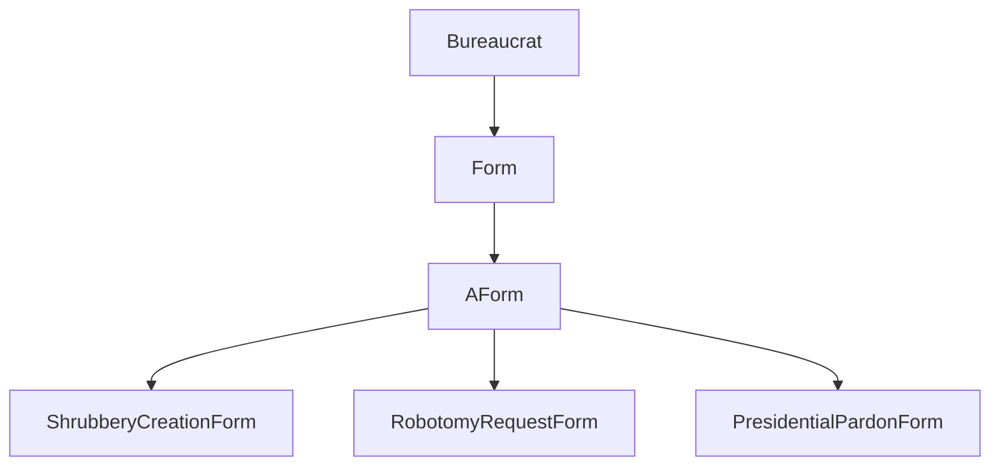
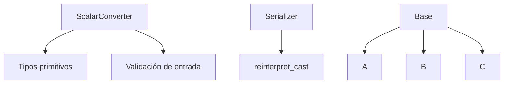

# 💻 C++ Modules (CPP05–CPP09) – 42

## 🧭 Introducción
Los módulos **CPP05 → CPP09** del cursus de **42** representan la **segunda etapa del aprendizaje de C++**, centrada en las características avanzadas del lenguaje y su aplicación práctica.

Mientras que los módulos **CPP00–CPP04** se enfocan en los fundamentos de la **Programación Orientada a Objetos (POO)**, este bloque lleva esas bases al siguiente nivel: manejo de **excepciones**, **conversiones de tipo**, **plantillas (templates)** y **contenedores de la STL**.  
El objetivo es escribir código **genérico, reutilizable y seguro**, aplicando las mejores prácticas modernas de C++.

---

## 📚 Tabla de Contenidos
- [⚠️ CPP05 – Excepciones y control de flujo](#-cpp05--excepciones-y-control-de-flujo)
- [🔄 CPP06 – Conversión de tipos y castings](#-cpp06--conversión-de-tipos-y-castings)
- [🧩 CPP07 – Plantillas y programación genérica](#-cpp07--plantillas-y-programación-genérica)
- [📦 CPP08 – STL y algoritmos](#-cpp08--stl-y-algoritmos)
- [⚡ CPP09 – Contenedores personalizados y rendimiento](#-cpp09--contenedores-personalizados-y-rendimiento)
- [🧾 Conclusión General](#-conclusión-general)
- [📚 Recursos Recomendados](#-recursos-recomendados)

---

## 🧠 Objetivo general del bloque
Este conjunto de módulos introduce al estudiante a la **programación moderna en C++**, dominando conceptos como:
- **Excepciones y control de errores**
- **Conversión entre tipos primitivos y clases**
- **Templates y funciones genéricas**
- **Contenedores de la STL (Standard Template Library)**
- **Algoritmos, iteradores y eficiencia**
- **Optimización de código y buenas prácticas**

💡 En resumen: pasar de escribir código orientado a objetos a diseñar **código genérico, escalable y de alto rendimiento.**

---

## 🧾 Relación con los módulos anteriores
| Bloque | Enfoque principal | Resultado |
|--------|------------------|------------|
| **CPP00–CPP04** | Fundamentos de OOP | Diseño de clases y jerarquías orientadas a objetos |
| **CPP05–CPP09** | C++ avanzado | Diseño genérico, plantillas, STL y programación moderna |

---

# ⚠️ CPP05 – Excepciones y control de flujo

### 🎯 Objetivo del módulo
Aprender el uso de **excepciones en C++** como mecanismo de control de errores seguro y estructurado.  
El módulo entrena al estudiante para reemplazar el manejo de errores tradicional basado en *return codes* por un enfoque **orientado a objetos** mediante `try`, `throw` y `catch`.

Además, se profundiza en el concepto de **jerarquías de clases de excepción**, el **control del flujo de ejecución**, y la importancia de **mantener la coherencia del estado del programa** tras un error.

---

### 🧠 Conceptos teóricos clave

| Concepto | Descripción |
|-----------|-------------|
| **Excepciones (`try / throw / catch`)** | Mecanismo para manejar errores en tiempo de ejecución sin romper la lógica del programa. |
| **Jerarquías de excepciones** | Las clases de error heredan de `std::exception`, lo que permite capturarlas de forma genérica. |
| **Control de flujo** | Permite definir cómo se recupera el programa después de un error. |
| **Const-correctness en excepciones** | Las funciones `what()` deben ser constantes (`const noexcept`). |
| **Buenas prácticas** | Solo lanzar excepciones en situaciones excepcionales; evitar usarlas como lógica normal del programa. |

---

### 🧩 Ejercicio ex00 – *Bureaucrat*

#### 🎯 Objetivo
Implementar una clase que controle los **límites de valores** mediante excepciones personalizadas.

#### 💡 Descripción
`Bureaucrat` tiene un atributo `grade` que representa su rango.  
Los valores válidos están entre **1 (más alto)** y **150 (más bajo)**.  
Si un valor excede esos límites, se lanza una excepción.

```cpp
class Bureaucrat {
private:
    const std::string _name;
    int _grade;
public:
    Bureaucrat(std::string name, int grade);
    ~Bureaucrat();

    const std::string& getName() const;
    int getGrade() const;

    void incrementGrade();
    void decrementGrade();

    class GradeTooHighException : public std::exception {
        const char* what() const noexcept override;
    };
    class GradeTooLowException : public std::exception {
        const char* what() const noexcept override;
    };
};
```

#### 🧠 Conceptos aprendidos
- **Lanzamiento de excepciones personalizadas (`throw`)**
- **Captura con `try / catch`**
- **Diseño de clases robustas con validación interna**
- **Sobrecarga del operador `<<` para salida formateada**

---

### 🧩 Ejercicio ex01 – *Forms and Bureaucrats*

#### 🎯 Objetivo
Introducir relaciones entre clases y manejo de errores cruzados.

#### 💡 Descripción
Se añade la clase `Form`, que puede ser firmada por un `Bureaucrat` si su `grade` es lo suficientemente alto.  
Las reglas se verifican mediante excepciones.

```cpp
class Form {
private:
    const std::string _name;
    bool _isSigned;
    const int _gradeToSign;
    const int _gradeToExecute;
public:
    Form(std::string name, int gradeSign, int gradeExec);
    void beSigned(const Bureaucrat& b);

    class GradeTooHighException : public std::exception {
        const char* what() const noexcept override;
    };
    class GradeTooLowException : public std::exception {
        const char* what() const noexcept override;
    };
};
```

#### 🧠 Conceptos aprendidos
- **Comunicación entre clases mediante excepciones**
- **Control de flujo seguro en relaciones jerárquicas**
- **Uso del principio de *encapsulación con validación***

---

### 🧩 Ejercicio ex02 – *AForm, Shrubbery, Robotomy, Presidential***

#### 🎯 Objetivo
Aplicar el **polimorfismo** al sistema de formularios con **ejecuciones específicas** según el tipo de formulario.

#### 💡 Descripción
Se crean tres clases derivadas de una clase base `AForm`, cada una con su propio comportamiento de ejecución y validación.

```cpp
class AForm {
protected:
    std::string _target;
public:
    virtual void execute(const Bureaucrat& executor) const = 0;
};
```

Ejemplos de formularios:
- `ShrubberyCreationForm` — genera un archivo ASCII con árboles 🌲  
- `RobotomyRequestForm` — realiza una “robotomía” con 50% de éxito 🤖  
- `PresidentialPardonForm` — emite un perdón presidencial 🏛️  

#### 🧠 Conceptos aprendidos
- **Polimorfismo aplicado a excepciones**
- **Control de flujo jerárquico**
- **Uso de `virtual` y `override` con validación**
- **Manejo de errores específicos y generales**

---

### 📊 Diagrama CPP05



---

### 🧾 Resumen CPP05

| Concepto | Descripción |
|-----------|-------------|
| Excepciones | Control estructurado de errores en C++ |
| `try` / `throw` / `catch` | Flujo de manejo de errores |
| Clases personalizadas de excepción | Derivadas de `std::exception` |
| Polimorfismo en excepciones | Sobrescritura de `what()` |
| Robustez | Código seguro ante errores y validaciones |

💡 **CPP05** marca la transición hacia el **C++ robusto y orientado a errores**, donde cada clase gestiona su coherencia interna y se comunica mediante excepciones seguras.

# 🔄 CPP06 – Conversión de tipos y castings

### 🎯 Objetivo del módulo
Aprender a manipular y convertir **tipos de datos en C++**, tanto de forma **implícita** como **explícita**, utilizando los operadores de *casting* modernos del lenguaje (`static_cast`, `dynamic_cast`, `const_cast`, `reinterpret_cast`).  
Este módulo busca que el estudiante comprenda cómo C++ maneja la **conversión entre tipos primitivos, objetos y punteros**, y cuándo cada conversión es segura o peligrosa.

---

### 🧠 Conceptos teóricos clave

| Concepto | Descripción |
|-----------|-------------|
| **Conversión implícita** | El compilador transforma un tipo en otro automáticamente cuando es posible sin pérdida de información. |
| **Conversión explícita** | Se realiza mediante *casts* para indicar intencionalmente el cambio de tipo. |
| **`static_cast`** | Conversión segura y en tiempo de compilación entre tipos compatibles. |
| **`dynamic_cast`** | Conversión segura entre punteros o referencias dentro de una jerarquía de clases con funciones virtuales. |
| **`const_cast`** | Permite agregar o eliminar la cualificación `const` de una variable. |
| **`reinterpret_cast`** | Conversión de bajo nivel (peligrosa) que trata bits de memoria como otro tipo. |
| **Conversión de cadenas y números** | Uso de `std::stoi`, `std::stof`, `std::to_string`, etc. |

---

### 🧩 Ejercicio ex00 – *Scalar Converter*

#### 🎯 Objetivo
Implementar una clase que convierta una **cadena de texto** a los tipos primitivos `char`, `int`, `float` y `double`.

#### 💡 Descripción
El programa recibe un único argumento (una cadena) y determina su tipo antes de imprimir las conversiones posibles.

```cpp
int main(int argc, char **argv) {
    if (argc != 2) {
        std::cerr << "Usage: ./convert <literal>" << std::endl;
        return 1;
    }
    ScalarConverter::convert(argv[1]);
    return 0;
}
```

```cpp
class ScalarConverter {
private:
    ScalarConverter();
public:
    static void convert(std::string const &literal);
};
```

Ejemplo de salida:
```
$ ./convert 42
char: '*'
int: 42
float: 42.0f
double: 42.0
```

#### 🧠 Conceptos aprendidos
- **Conversión de cadenas a tipos primitivos.**
- **Validación y detección de tipo de dato.**
- **Uso de funciones estándar: `std::stoi`, `std::stod`, `std::stof`.**
- **Formato de salida y control de precisión.**

---

### 🧩 Ejercicio ex01 – *Serialization*

#### 🎯 Objetivo
Aprender a convertir punteros a valores enteros (y viceversa) mediante **reinterpretación de memoria**.

#### 💡 Descripción
Se define una estructura `Data` y una clase que implementa funciones `serialize` y `deserialize` usando `reinterpret_cast`.

```cpp
struct Data {
    std::string name;
    int age;
};
```

```cpp
class Serializer {
public:
    static uintptr_t serialize(Data* ptr);
    static Data* deserialize(uintptr_t raw);
};
```

Ejemplo:
```cpp
Data d = {"Alice", 25};
uintptr_t raw = Serializer::serialize(&d);
Data* ptr = Serializer::deserialize(raw);
std::cout << ptr->name << " - " << ptr->age << std::endl;
```

#### 🧠 Conceptos aprendidos
- **Uso de `reinterpret_cast` para manipular direcciones.**
- **Comprensión del tipo `uintptr_t`.**
- **Conversión entre punteros y enteros de forma controlada.**
- **Representación interna de datos en memoria.**

---

### 🧩 Ejercicio ex02 – *Dynamic Casting*

#### 🎯 Objetivo
Aplicar **casting dinámico (`dynamic_cast`)** para identificar el tipo real de objetos en tiempo de ejecución.

#### 💡 Descripción
Se crea una jerarquía de clases con una base `Base` y tres derivadas (`A`, `B`, `C`).  
El programa genera una instancia aleatoria y luego la identifica mediante `dynamic_cast`.

```cpp
class Base { public: virtual ~Base() {}; };
class A : public Base {};
class B : public Base {};
class C : public Base {};

Base* generate();
void identify(Base* p);
void identify(Base& p);
```

Uso típico:
```cpp
Base* ptr = generate();
identify(ptr);   // output: "Actual type: B"
identify(*ptr);  // output: "Actual type: B"
```

#### 🧠 Conceptos aprendidos
- **Uso práctico de `dynamic_cast`.**
- **Identificación de tipos en tiempo de ejecución (RTTI).**
- **Comparación entre `dynamic_cast` y `static_cast`.**
- **Diseño de jerarquías con funciones virtuales.**

---

### 📊 Diagrama CPP06



---

### 🧾 Resumen CPP06

| Concepto | Descripción |
|-----------|-------------|
| `static_cast` | Conversión segura en tiempo de compilación |
| `dynamic_cast` | Conversión segura en tiempo de ejecución |
| `const_cast` | Añade o elimina `const` |
| `reinterpret_cast` | Reinterpreta los bits de memoria (peligroso) |
| RTTI | *Run-Time Type Information* para determinar tipos reales |
| Conversión de cadenas | De texto a numérico (`std::stoi`, `std::stof`, etc.) |

💡 **CPP06** enseña cómo C++ gestiona la **tipificación estricta** y cómo el programador puede manipular tipos con precisión, seguridad y control total sobre la memoria.

# 🧩 CPP07 – Plantillas y programación genérica

### 🎯 Objetivo del módulo
Introducir el concepto de **programación genérica** mediante el uso de **plantillas (templates)** en C++.  
El objetivo es diseñar **clases y funciones reutilizables** que funcionen con cualquier tipo de dato, sin duplicar código.  

Este módulo es el punto de partida hacia el **paradigma de metaprogramación**, base de la STL y de librerías modernas de C++.

---

### 🧠 Conceptos teóricos clave

| Concepto | Descripción |
|-----------|-------------|
| **Templates** | Mecanismo que permite definir clases y funciones genéricas. |
| **Function Templates** | Permiten escribir una función que trabaje con múltiples tipos (`template<typename T>`). |
| **Class Templates** | Permiten crear clases genéricas que se instancian con diferentes tipos. |
| **Template specialization** | Personalización de una plantilla para un tipo específico. |
| **`typename` vs `class`** | Palabras clave equivalentes en la declaración de plantillas. |
| **Instanciación** | Proceso en el que el compilador genera código concreto a partir de una plantilla. |
| **Generic Programming** | Paradigma basado en escribir código que se adapte a cualquier tipo. |

---

### 🧩 Ejercicio ex00 – *Templates Basics*

#### 🎯 Objetivo
Entender cómo declarar, definir e instanciar **funciones plantilla** en C++.

#### 💡 Descripción
Se deben implementar tres funciones genéricas: `swap`, `min` y `max`, que funcionen con cualquier tipo compatible.

```cpp
template <typename T>
void swap(T &a, T &b) {
    T temp = a;
    a = b;
    b = temp;
}

template <typename T>
T const &min(T const &a, T const &b) {
    return (a < b ? a : b);
}

template <typename T>
T const &max(T const &a, T const &b) {
    return (a > b ? a : b);
}
```

#### Ejemplo:
```cpp
int a = 2, b = 3;
::swap(a, b);
std::cout << "min: " << ::min(a, b) << ", max: " << ::max(a, b) << std::endl;
```

#### 🧠 Conceptos aprendidos
- **Declaración de funciones genéricas.**
- **Parámetros de tipo (`typename T`).**
- **Comparación y operaciones con tipos arbitrarios.**
- **Instanciación automática de plantillas.**

---

### 🧩 Ejercicio ex01 – *Array Template*

#### 🎯 Objetivo
Diseñar una **clase plantilla genérica** que represente un array con control de límites.

#### 💡 Descripción
Se crea una clase `Array<T>` que gestione internamente un puntero dinámico y proporcione operaciones seguras de acceso mediante `operator[]`.

```cpp
template <typename T>
class Array {
private:
    T* _array;
    unsigned int _size;
public:
    Array() : _array(NULL), _size(0) {}
    Array(unsigned int n) : _array(new T[n]()), _size(n) {}
    Array(const Array &other);
    Array &operator=(const Array &other);
    ~Array();

    T &operator[](unsigned int index);
    const T &operator[](unsigned int index) const;
    unsigned int size() const;
};
```

#### 🧠 Conceptos aprendidos
- **Uso de templates en clases.**
- **Control de memoria dinámica con tipos genéricos.**
- **Implementación de `operator[]` seguro (con excepciones).**
- **Regla de los tres (constructor, asignación y destructor).**
- **Uso de `const` y sobrecarga de operadores en plantillas.**

---

### 💡 Ejemplo de uso
```cpp
Array<int> intArray(5);
for (unsigned int i = 0; i < intArray.size(); i++)
    intArray[i] = i * 10;

Array<std::string> strArray(3);
strArray[0] = "Hello";
strArray[1] = "C++";
strArray[2] = "Templates";

for (unsigned int i = 0; i < strArray.size(); i++)
    std::cout << strArray[i] << std::endl;
```

---

### 📊 Diagrama CPP07

```mermaid
graph TD
    A[Template Functions] --> B[swap(T)]
    A --> C[min(T)]
    A --> D[max(T)]
    E[Class Template Array<T>] --> F[Dynamic Memory]
    E --> G[Operator Overloading]
    G --> H[Exceptions]
```

---

### 🧾 Resumen CPP07

| Concepto | Descripción |
|-----------|-------------|
| Function Templates | Código genérico reutilizable para múltiples tipos |
| Class Templates | Clases parametrizadas por tipo (`Array<T>`) |
| Especialización | Adaptación de una plantilla a un tipo concreto |
| Tipos genéricos | `typename` o `class` como parámetros de plantilla |
| Seguridad | Control de límites y excepciones |
| Reutilización | Código flexible y libre de duplicación |

💡 **CPP07** enseña a diseñar código **modular, genérico y reusable**, piedra angular del estilo moderno de C++.  
Este módulo abre la puerta al uso completo de la **STL (Standard Template Library)** que se aborda en el siguiente.
